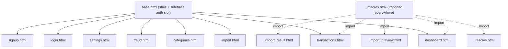

# Components

## Template layout & inheritance

- `base.html` is the single layout. It branches on `user`: when present it renders the
  `app-shell` (sidebar nav + topbar + `content` block); otherwise it renders the `auth`
  block. The `data-theme` attribute on `<html>` is driven by `s.theme` when available
  (`base.html:2`).
- The sidebar nav list and active-state logic live inline in `base.html:15-24` (not a
  macro) — see the architecture-quality review for the duplicate-nav note.

## Reusable Jinja macros (`_macros.html`)

| Macro | Signature | Output | Used by |
|-------|-----------|--------|---------|
| `money` | `money(value)` | `'%.2f'` formatted number | dashboard, transactions |
| `confidence_badge` | `confidence_badge(score)` | `.badge` pill, colour by ≥80 / ≥50 / else; `—` when none | transactions, `_resolve`, `_import_preview`, `_import_result` |
| `status_pill` | `status_pill(status)` | `.pill` for confirmed / pending_confirmation / needs_review | transactions |
| `decision_label` | `decision_label(decision)` | `.pill` for auto_saved / confirmation_required / manual_required | `_resolve`, `_import_preview`, `_import_result` |
| `breakdown_bars` | `breakdown_bars(b)` | per-signal score bars (past 40 / amount 20 / category 15 / correction 15 / time 10) | `_resolve`, `_import_preview`, `_import_result` |

The max values in `breakdown_bars` (40/20/15/15/10) are hard-coded in the template and
mirror the engine weights in `engine.py:23-27`. Keep these in sync.

## Partial templates (AJAX fragments)

These are not standalone pages — they are rendered server-side and swapped into the DOM:

- `_resolve.html` — engine suggestion card for the live transaction preview. Falls back to
  a "new payee" note when `best` is null.
- `_import_preview.html` — editable parsed-SMS form + resolution preview; its `#create-form`
  is wired up by `import.html`'s JS.
- `_import_result.html` — post-save confirmation with decision/confidence, optional fraud
  warning, and follow-up links.

## CSS component classes (`static/styles.css`)

Single stylesheet, CSS custom properties for theming (light defaults in `:root`,
`[data-theme="dark"]` overrides, plus a `prefers-color-scheme` block for `system`).

| Group | Classes | Notes |
|-------|---------|-------|
| Shell | `.app-shell`, `.sidebar`, `.brand`, `.nav-link`(`.active`), `.sidebar-foot`, `.who`, `.content`, `.topbar`, `.hamburger` | Sidebar is sticky desktop, off-canvas (`body.nav-open`) on ≤820px |
| Layout | `.grid`, `.cards`, `.cols-2`, `.row`, `.field`, `.section-title` | `.cols-2` collapses to 1 column on mobile |
| Cards/stats | `.card`, `.stat`(`.label`/`.value`), `.value.income`/`.expense` | |
| Tables | `table`, `th`, `td`, `.amt`(`.income`/`.expense`) | tabular-nums for amounts |
| Badges/pills | `.badge`(`-high`/`-mid`/`-low`/`-muted`), `.pill`(`-ok`/`-warn`/`-review`) | severity: `.sev-high`/`-medium`/`-low` |
| Forms/buttons | `input`/`select`/`textarea`, `.btn`, `.btn-ghost`, `.btn-sm`, `.btn-danger`, `.inline-form` | |
| Feedback | `.flash`, `.error`, `.muted`, `.empty`, `.insights` | |
| Score bars | `.breakdown`, `.bd-row`, `.bd-label`, `.bd-track`, `.bd-fill`, `.bd-val` | grid 130px / 1fr / 56px |
| Auth | `.auth-wrap`, `.auth-card`(`.brand`/`.sub`), `.auth-alt` | radial-gradient backdrop |

Theming tokens (`--bg`, `--surface`, `--surface-2`, `--text`, `--muted`, `--border`,
`--primary`/`-d`, `--ok`, `--warn`, `--danger`, `--review`, `--radius`, `--shadow`) are the
clean seam for a UI refresh: most restyling can be done by editing these without touching
markup or Python.

> Caveat for a UI refactor: several templates carry inline `style="..."` attributes
> (e.g. `_resolve.html`, `_import_preview.html`, `_import_result.html`, `dashboard.html`,
> `transactions.html`, `categories.html`). These bypass the stylesheet and are documented
> in `docs/reviews/architecture-quality.md` as a P2 cleanup target.
