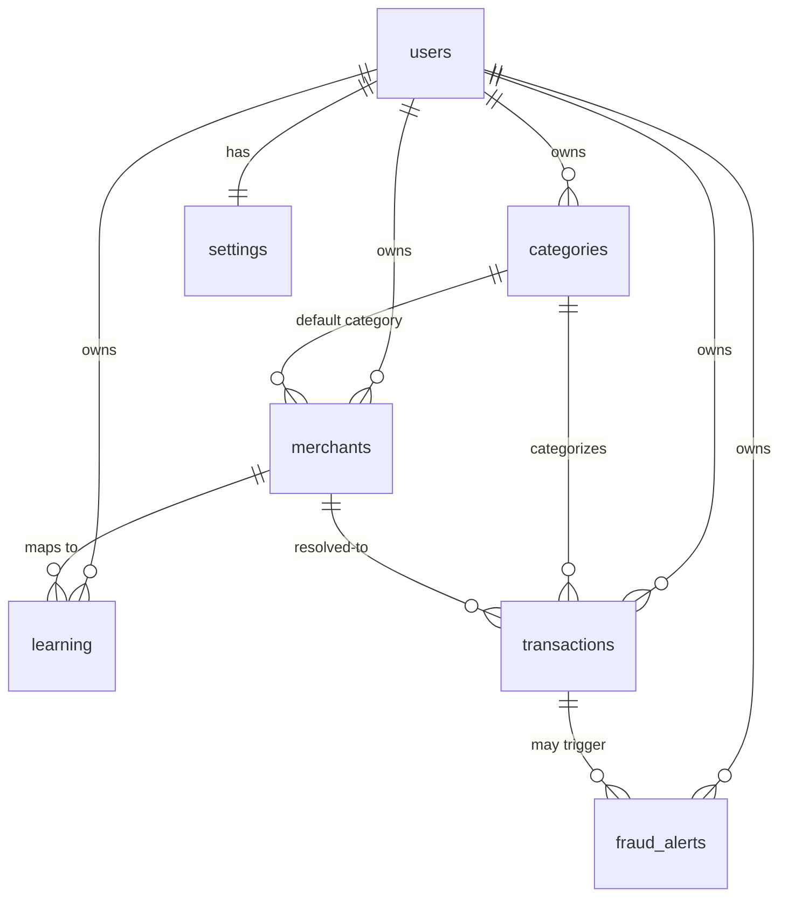

# Database Schema

Source of truth: the `SCHEMA` string in `db.py:13-95`, applied by `db.init_db`
(`db.py:113-115`). SQLite, standard library only. Connections use WAL journal mode and
`foreign_keys=ON` (`db.py:108-109`), though no `FOREIGN KEY` constraints are declared in the
schema — relationships are by convention on `user_id` / `*_id` text columns. Primary keys
are UUID hex strings (`db.new_id`, `db.py:98-99`); timestamps are ISO-8601 text (UTC).

## Entity-relationship overview

All relationships are logical (joined on text ids in queries); not DB-enforced.

## Tables

### users (`db.py:14-20`)
| Column | Type | Notes |
|--------|------|-------|
| id | TEXT PK | uuid hex |
| email | TEXT UNIQUE NOT NULL | lowercased on write |
| full_name | TEXT NOT NULL | |
| pw_hash | TEXT NOT NULL | `pbkdf2$sha256$rounds$salt$hash` (`auth.py:39-42`) |
| created_at | TEXT NOT NULL | ISO timestamp |

### categories (`db.py:21-30`)
| Column | Type | Notes |
|--------|------|-------|
| id | TEXT PK | |
| user_id | TEXT NOT NULL | owner |
| name | TEXT NOT NULL | |
| type | TEXT NOT NULL DEFAULT 'expense' | income / expense |
| icon | TEXT NOT NULL DEFAULT 'Tag' | lucide-style icon name |
| color | TEXT NOT NULL DEFAULT '#6366f1' | hex |
| is_archived | INTEGER NOT NULL DEFAULT 0 | soft hide |
| | UNIQUE(user_id, name) | no duplicate names per user |

### merchants (`db.py:31-37`)
| Column | Type | Notes |
|--------|------|-------|
| id | TEXT PK | |
| user_id | TEXT NOT NULL | owner |
| canonical_name | TEXT NOT NULL | the "real" merchant the user confirmed |
| category_id | TEXT | default category for this merchant |
| | UNIQUE(user_id, canonical_name) | |

### learning (`db.py:38-56`)
Maps a normalized raw SMS name → a merchant, accumulating the signals used for confidence.
| Column | Type | Notes |
|--------|------|-------|
| id | TEXT PK | |
| user_id | TEXT NOT NULL | |
| raw_name | TEXT NOT NULL | normalized (`engine.normalize_merchant`) |
| merchant_id | TEXT NOT NULL | |
| merchant_name | TEXT NOT NULL | denormalized canonical name |
| category_id | TEXT | |
| confidence | INTEGER NOT NULL DEFAULT 0 | cached baseline (`_baseline_confidence`) |
| confirmation_count | INTEGER NOT NULL DEFAULT 0 | times confirmed |
| correction_count | INTEGER NOT NULL DEFAULT 0 | times this mapping was overridden |
| sample_count | INTEGER NOT NULL DEFAULT 0 | amount samples seen |
| avg_amount | REAL NOT NULL DEFAULT 0 | running mean |
| amount_min / amount_max | REAL NOT NULL DEFAULT 0 | range |
| hour_histogram | TEXT NOT NULL DEFAULT '[]' | JSON 24-int array (time-of-day) |
| last_seen_at | TEXT | ISO timestamp |
| | UNIQUE(user_id, raw_name, merchant_id) | one row per raw→merchant pair |
| Index | `ix_learning_user_raw (user_id, raw_name)` | lookup during `resolve` |

### transactions (`db.py:57-75`)
| Column | Type | Notes |
|--------|------|-------|
| id | TEXT PK | |
| user_id | TEXT NOT NULL | |
| amount | REAL NOT NULL | |
| type | TEXT NOT NULL DEFAULT 'expense' | income / expense |
| category_id | TEXT | |
| raw_merchant | TEXT | original SMS / input name |
| merchant_id | TEXT | resolved merchant (nullable) |
| merchant_name | TEXT | resolved canonical name |
| notes | TEXT | |
| reference_number | TEXT | from SMS |
| occurred_at | TEXT NOT NULL | ISO timestamp |
| source | TEXT NOT NULL DEFAULT 'manual' | manual / sms |
| confidence | INTEGER | engine score at creation (nullable) |
| status | TEXT NOT NULL DEFAULT 'confirmed' | confirmed / pending_confirmation / needs_review |
| is_deleted | INTEGER NOT NULL DEFAULT 0 | soft delete |
| created_at | TEXT NOT NULL | |
| Index | `ix_tx_user_occurred (user_id, occurred_at)` | listing / time queries |

### fraud_alerts (`db.py:76-86`)
| Column | Type | Notes |
|--------|------|-------|
| id | TEXT PK | |
| user_id | TEXT NOT NULL | |
| transaction_id | TEXT | the triggering tx |
| alert_type | TEXT NOT NULL | duplicate / high_value_outlier / abnormal_spend / unusual_merchant |
| severity | TEXT NOT NULL DEFAULT 'low' | low / medium / high |
| message | TEXT NOT NULL | human-readable |
| details | TEXT NOT NULL DEFAULT '{}' | JSON payload |
| status | TEXT NOT NULL DEFAULT 'open' | open / dismissed / resolved |
| created_at | TEXT NOT NULL | |

### settings (`db.py:87-94`)
One row per user (PK is `user_id`).
| Column | Type | Notes |
|--------|------|-------|
| user_id | TEXT PK | |
| currency | TEXT NOT NULL DEFAULT 'INR' | |
| theme | TEXT NOT NULL DEFAULT 'system' | system / light / dark |
| auto_save_threshold | INTEGER NOT NULL DEFAULT 80 | ≥ → auto_saved |
| confirm_threshold | INTEGER NOT NULL DEFAULT 50 | ≥ → confirmation_required |
| high_value_amount | REAL | optional fraud trigger |

## Status / enum vocabulary (used by templates)
- Transaction status: `confirmed`, `pending_confirmation`, `needs_review`
  (constants `TX_CONFIRMED/PENDING/REVIEW`, `app.py:20`).
- Engine decision: `auto_saved`, `confirmation_required`, `manual_required`
  (`engine.py:30-32`).
- Fraud severity: `low`, `medium`, `high` (`fraud.py:16`).

These vocabularies map 1:1 to the pill/badge classes in `_macros.html` — useful when
restyling status indicators.
