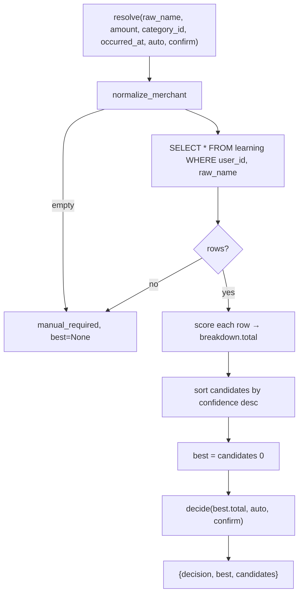
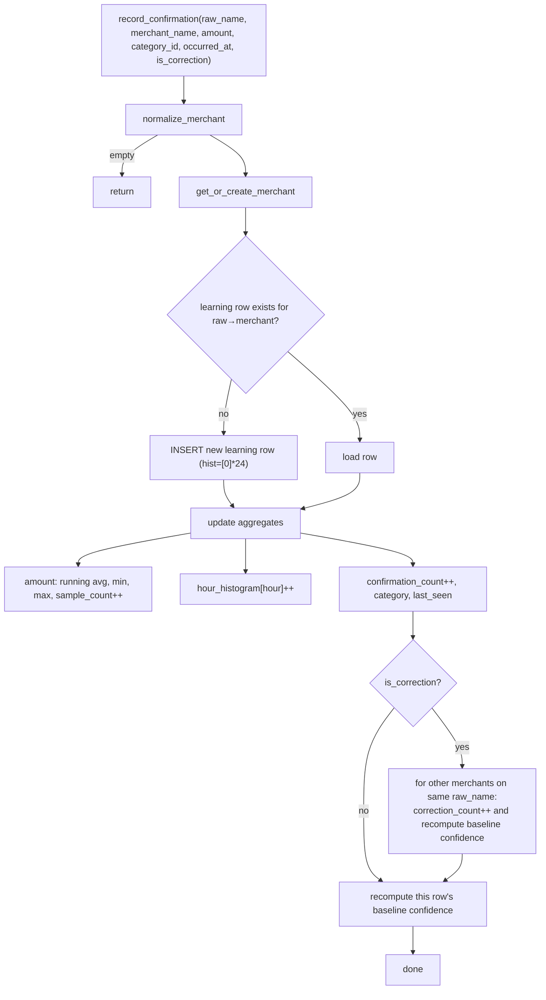

# Merchant Resolution, Confidence Scoring & Learning

All logic lives in `engine.py`. It has zero external dependencies (stdlib + `db`), so it
runs unchanged on-device.

## Confidence weights (total 100)

`engine.py:23-28`:

| Signal | Weight | Scoring function |
|--------|-------:|------------------|
| Past mapping | 40 | `_score_past` (`engine.py:58`) |
| Amount pattern | 20 | `_score_amount` (`engine.py:64`) |
| Category pattern | 15 | `_score_category` (`engine.py:77`) |
| Correction history | 15 | `_score_correction` (`engine.py:85`) |
| Time pattern | 10 | `_score_time` (`engine.py:90`) |

`_FULL_TRUST = 5.0` (`engine.py:28`) is the strength at which "past mapping" saturates.

### How each signal scores
- **Past mapping** (`_score_past`): `strength = confirmation_count + 0.5*sample_count − correction_count`,
  clamped to `[0,1]` after dividing by `_FULL_TRUST`, times 40. More confirmations and
  samples raise it; corrections lower it.
- **Amount pattern** (`_score_amount`): closeness of the current amount to the learned
  average, with tolerance `max(avg*0.25, (max−min)/2, 1.0)`; floor of 0.6 closeness when the
  amount is inside the seen `[min,max]` range. Zero when no samples.
- **Category pattern** (`_score_category`): full 15 when the supplied `category_id` matches
  the learned one; 7.5 when no category is supplied but one is learned; 0 otherwise.
- **Correction history** (`_score_correction`): `15 * (confirmation_count+1)/(confirmation_count+correction_count+1)` —
  a smoothed confirmation ratio that decays with corrections.
- **Time pattern** (`_score_time`): looks up the hour bucket in the 24-slot
  `hour_histogram`, normalized to the peak bucket, times 10. Zero without an occurrence time
  or an empty histogram.

The five are summed, clamped to `[0,100]`, rounded to an int (`score`, `engine.py:102-111`).

## Decision thresholds

`decide(total, auto, confirm)` (`engine.py:114-119`):
- `total >= auto` → `auto_saved`
- `total >= confirm` → `confirmation_required`
- else → `manual_required`

`auto`/`confirm` come from the user's settings (`auto_save_threshold` default 80,
`confirm_threshold` default 50). The app passes them through from `settings_for(uid)`
(`app.py:128`, `267`, `327`).

## Normalization

`normalize_merchant` (`engine.py:42-51`) uppercases, drops everything after `@`, replaces
separators with spaces, strips long digit runs and non-alphanumerics, then removes noise
tokens (`UPI`, `VPA`, `P2M`, `NEFT`, `PVT`, `LTD`, …). Example:
`UPI/RAJESH KUMAR/9876543210@okhdfc` → `RAJESH KUMAR`. Both `resolve` and
`record_confirmation` normalize before touching the `learning` table, so lookups line up.

## Resolution flow

`resolve` (`engine.py:122-143`) returns the best candidate plus the full breakdown the UI
renders via `_macros.breakdown_bars`.

## Learning / correction loop

`record_confirmation` (`engine.py:172-245`) is the write side. It is called:
- when a transaction is auto-saved by the engine (`app.py:137`),
- when a manual transaction includes an explicit merchant (`app.py:122`),
- when the user confirms/corrects a pending item (`app.py:292`, with `is_correction`).

Key behaviors:
- **Confirmation** bumps `confirmation_count`, folds the amount into the running
  mean/min/max, increments the time-of-day bucket, and refreshes the cached `confidence`
  (`_baseline_confidence`, `engine.py:162-169`).
- **Correction** (`is_correction=True`, raised in `app.py:282` when the confirmed merchant
  differs from the previously resolved one) additionally increments `correction_count` on
  the *other* candidate mappings for that raw name and recomputes their cached confidence
  (`engine.py:232-241`) — so the wrong mapping is penalized next time while the corrected
  one is reinforced.

## Full correction journey (end-to-end)

1. SMS/manual entry with an unknown raw name → `resolve` finds no rows → `manual_required`,
   transaction saved with `status = needs_review` (`app.py:146`).
2. User opens Transactions, types the real merchant in the inline confirm form, submits to
   `/transactions/confirm` (`app.py:272`).
3. Handler creates/links the merchant, marks the tx `confirmed` with confidence 100, and
   calls `record_confirmation` (with `is_correction` if the merchant changed).
4. Next time the same raw name arrives, `resolve` now has a learning row; as
   confirmation_count grows past `_FULL_TRUST`, the past-mapping signal saturates and the
   decision moves up to `confirmation_required` then `auto_saved`.

> The breakdown max values shown in the UI (`_macros.html breakdown_bars`) must stay equal
> to the weights here (40/20/15/15/10). A UI refactor can restyle the bars but must not
> change those numbers.
