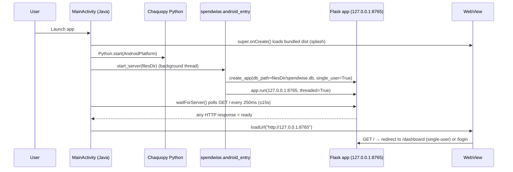
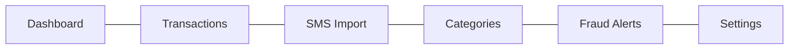
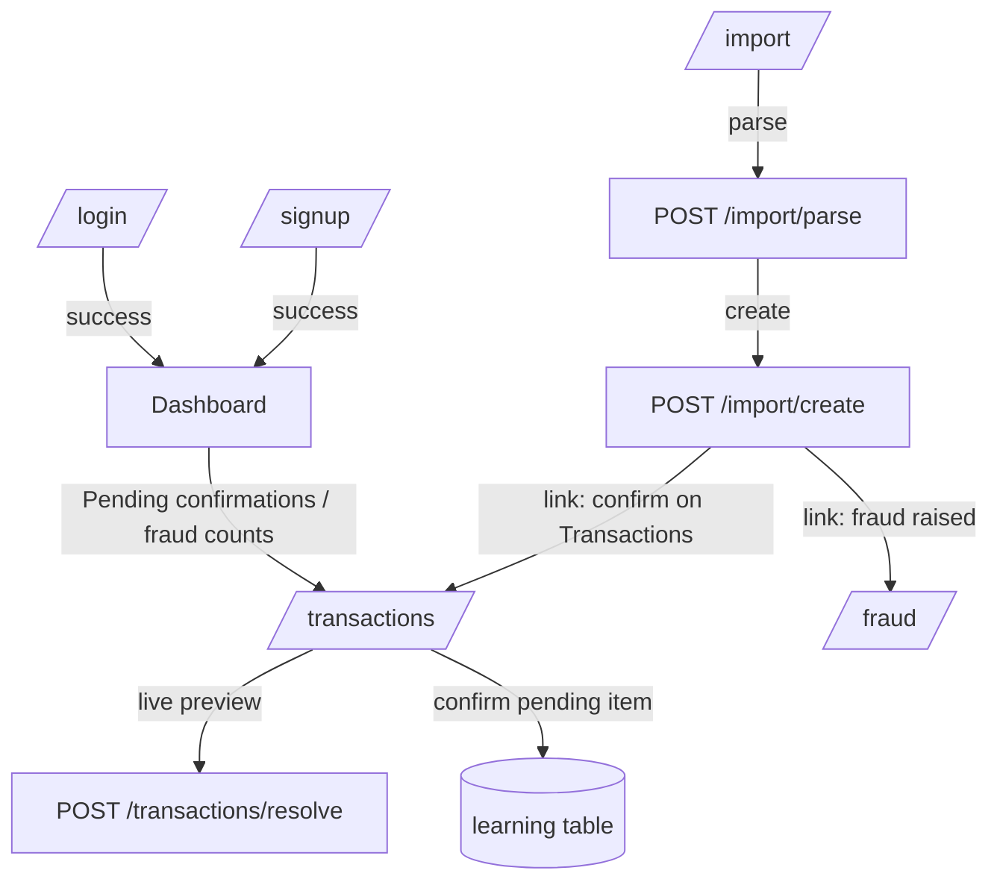

# Navigation Map

Scope: the Flask + Jinja2 + stdlib-sqlite3 app in `python_app/spendwise/` that ships
inside the Android APK (via Chaquopy) and renders in the Capacitor WebView.

## Android bootstrap → localhost flow

`android/app/src/main/java/com/jeevavibeapp/spendwise/MainActivity.java` starts the
embedded Python Flask server and points the WebView at it.

Key references:
- `MainActivity.java:17` `SERVER_URL = http://127.0.0.1:8765`
- `MainActivity.java:46-72` `startServerAndLoad` (start server, poll, load URL)
- `MainActivity.java:75-105` `waitForServer` readiness poll
- `android_entry.py:27-44` `start_server` (idempotent, daemon thread) returns URL
- `android_entry.py:19-24` `_run` builds the app with `single_user=True`

In single-user (mobile) mode, `before_request` auto-creates/loads the one local user
(`app.py:40-41`, `auth.ensure_local_user`), so the user never sees `/login` — `/` lands
directly on the dashboard.

## Route inventory

| Method(s) | Path | Endpoint | Renders / returns | Notes |
|-----------|------|----------|-------------------|-------|
| GET | `/` | `index` | redirect | → `dashboard` if logged in else `login` (`app.py:169`) |
| GET/POST | `/login` | `login` | `login.html` / redirect | `app.py:173` |
| GET/POST | `/signup` | `signup` | `signup.html` / redirect | `app.py:188` |
| POST | `/logout` | `logout` | redirect → `login` | clears session (`app.py:205`) |
| GET | `/dashboard` | `dashboard` | `dashboard.html` | `app.py:211` |
| GET | `/transactions` | `transactions` | `transactions.html` | supports `?q=` search (`app.py:221`) |
| POST | `/transactions` | `transactions_create` | redirect | manual add (`app.py:242`) |
| POST | `/transactions/resolve` | `transactions_resolve` | `_resolve.html` fragment | live AJAX preview (`app.py:257`) |
| POST | `/transactions/<id>/confirm` | `transactions_confirm` | redirect | correction → learning (`app.py:272`) |
| POST | `/transactions/<id>/delete` | `transactions_delete` | redirect | soft delete (`app.py:299`) |
| GET | `/import` | `import_page` | `import.html` | `app.py:310` |
| POST | `/import/parse` | `import_parse` | `_import_preview.html` fragment | AJAX (`app.py:317`) |
| POST | `/import/create` | `import_create` | `_import_result.html` fragment | AJAX (`app.py:333`) |
| GET | `/categories` | `categories_page` | `categories.html` | `app.py:351` |
| POST | `/categories` | `categories_create` | `categories.html` | re-renders with flash/error (`app.py:359`) |
| POST | `/categories/<id>/delete` | `categories_delete` | redirect | hard delete (`app.py:382`) |
| GET | `/fraud` | `fraud_page` | `fraud.html` | `app.py:392` |
| POST | `/fraud/<id>/status` | `fraud_update` | redirect | dismiss/resolve (`app.py:402`) |
| GET/POST | `/settings` | `settings_page` | `settings.html` | `app.py:415` |
| GET | `/healthz` | `healthz` | JSON | liveness probe used by Android poll (`app.py:438`) |

## Primary navigation (sidebar)

The persistent left sidebar (`base.html:12-32`) is the main navigation; it renders only
when `user` is truthy. Six links driven by the `nav` list in the template:

The active link is highlighted via `active == key` comparison against the `active=...`
kwarg each GET route passes to `render_template`.

## Cross-screen flows

Notable in-page (non-link) navigation:
- `transactions.html` JS posts to `/transactions/resolve` on merchant input (debounced 400ms)
  and injects the `_resolve.html` fragment into `#resolve-preview`.
- `import.html` JS intercepts the parse form, posts to `/import/parse`, then wires the
  returned create form to post to `/import/create`, swapping `#parse-out` in place.
- `_import_result.html` provides explicit anchor links back to `/import`, `/transactions`,
  and `/fraud`.
