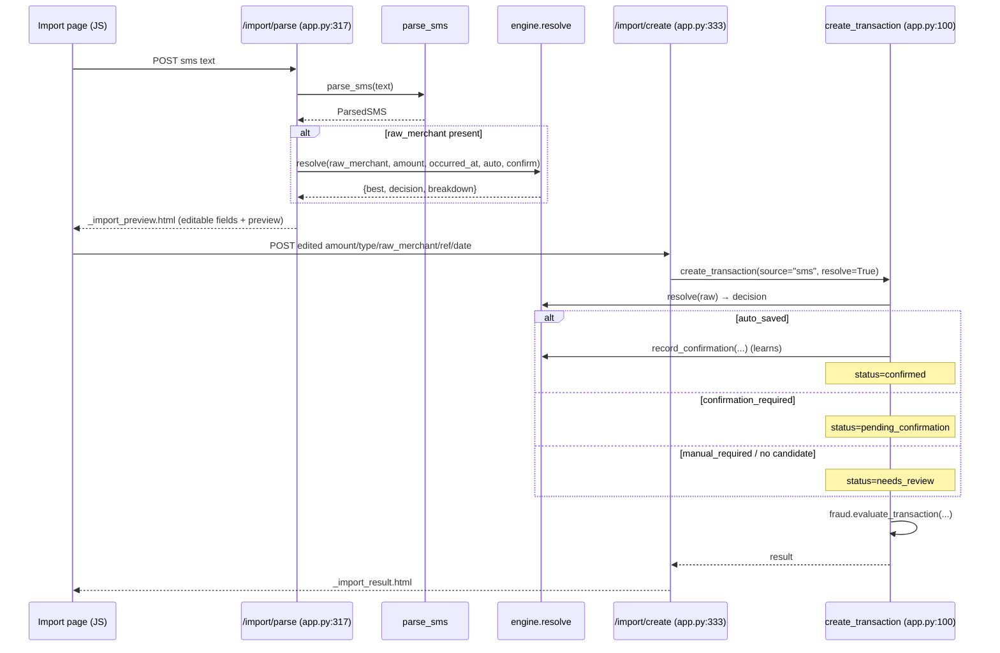

# SMS Parsing

`parsing.py` is a deterministic, regex-only parser (standard library only). It turns a
bank/UPI SMS string into a `ParsedSMS` dataclass; it does no DB work and no resolution —
those happen in the routes afterward.

## `ParsedSMS` (`parsing.py:27-34`)

| Field | Default | Meaning |
|-------|---------|---------|
| amount | None | parsed numeric amount |
| type | "expense" | "income" if credited and not debited |
| raw_merchant | None | text after `to/at/from/vpa/towards/info:` |
| reference_number | None | ref / txn / utr / upi ref code |
| occurred_at | None | parsed date (+ optional time), UTC |
| matched | False | True if an amount or a merchant was found |

## Parse flow

```mermaid
flowchart TD
    A["parse_sms(text)"] --> B{empty?}
    B -->|yes| Z[ParsedSMS()]
    B -->|no| C["_parse_amount: (rs|inr|₹) <number>"]
    C --> D["type: CREDIT_RE and not DEBIT_RE → income else expense"]
    D --> E["_parse_merchant: to/at/from/vpa/towards/info → name"]
    E --> F["_REF_RE: ref/txn/utr/upi ref → reference_number"]
    F --> G["_parse_date: dd-Mon-yyyy / dd-mm-yy / yyyy-mm-dd (+ optional HH:MM)"]
    G --> H["matched = amount is not None OR raw_merchant is not None"]
    H --> R[ParsedSMS]
```

Regex anchors (`parsing.py:9-24`):
- **Amount** `_AMOUNT_RE`: currency token (`Rs.`/`INR`/`₹`) followed by a number with
  optional thousands separators and up to 2 decimals.
- **Type**: `_CREDIT_RE` (credited/received/deposited) wins only if `_DEBIT_RE`
  (debited/spent/paid/sent/withdrawn/purchase) is absent; otherwise expense.
- **Merchant** `_MERCHANT_RE`: captures 1–60 chars after a preposition keyword, stopping at
  the next keyword (`on/ref/txn/utr/upi/avl/a/c/bal/info/via`), punctuation, or end.
  `_parse_merchant` trims and drops any `@vpa` suffix.
- **Reference** `_REF_RE`: 6+ alphanumerics after ref/txn/utr/upi-ref labels.
- **Date** `_DATE_RES` (three patterns) + `_TIME_RE`; tries multiple `strptime` formats,
  defaults time to 00:00, returns a UTC datetime.

## How parsing feeds resolution and transaction creation



Two-step design rationale (`app.py:317-348`):
1. `/import/parse` is read-only — it parses and *previews* the engine's suggestion without
   writing anything. The user can edit any field (amount, type, raw merchant, reference,
   date) in `_import_preview.html` before committing.
2. `/import/create` re-runs resolution inside `create_transaction` against the (possibly
   edited) values, writes the transaction, records learning when auto-saved, and runs fraud
   detection. The previewed decision is recomputed at save time, so edits are honored.

## Android SMS hook (context)

On device, `SmsReceiver.java` receives `SMS_RECEIVED` broadcasts and forwards
`{sender, body}` to the Capacitor plugin via `SpendWisePlugin.onSmsReceived`
(`SmsReceiver.java:28`, `SpendWisePlugin.java:19-26`), which emits an `onSMSReceived` JS
event. The current Python/web UI exposes manual paste-and-parse on the Import screen; the
native broadcast path is the wiring that would let captured SMS bodies feed the same
`/import/parse` flow. This is native-shell context only and out of scope for a UI refactor.
