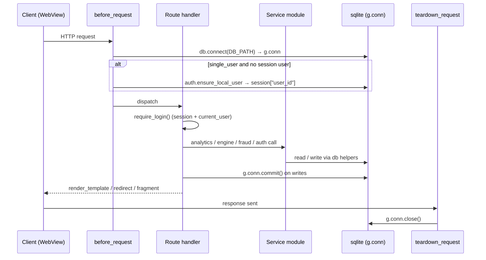

# State Management & Request Lifecycle

## App construction

`create_app(db_path, single_user, secret_key)` (`app.py:23`) is an application factory.
It sets three config values, derives a random `secret_key` if none is supplied
(`app.py:28-29`), and runs `db.init_db` once at startup against a throwaway connection
(`app.py:32-34`). All routes are defined as closures inside the factory, so helpers like
`current_user`, `settings_for`, `create_transaction` close over `app` and use `g.conn`.

| Config key | Source | Effect |
|------------|--------|--------|
| `DB_PATH` | arg / `SPENDWISE_DB` / `spendwise.db` | sqlite file path |
| `SINGLE_USER` | arg / `SPENDWISE_SINGLE_USER=1` | auto-login the one local user |
| `secret_key` | arg / `SPENDWISE_SECRET` / `os.urandom(32)` | signs the session cookie |

## Request lifecycle

- `before_request` `_open_db` (`app.py:37-41`) opens a fresh connection per request into
  `g.conn`, and in single-user mode seeds the session with the local user id.
- `teardown_request` `_close_db` (`app.py:43-47`) closes the connection. Note: it does not
  commit — each write handler commits explicitly (e.g. `app.py:163`, `296`, `306`).

## Session & auth state

- The only session key is `user_id` (`session["user_id"]`). It is set on login/signup
  (`app.py:184`, `201`), seeded in single-user mode (`app.py:41`), and cleared on logout
  (`session.clear()`, `app.py:207`).
- `require_login()` (`app.py:94-97`) gates every authenticated handler: it returns the uid
  if the session has one *and* `current_user()` resolves a real row, else `None`. Handlers
  then redirect to `/login` (page routes) or `abort(401)` (AJAX routes like
  `/transactions/resolve`, `/import/*`).
- `current_user()` (`app.py:50-54`) loads the user row from `g.conn` each call.

## Single-user (mobile) mode

When `SINGLE_USER` is on (the APK path, set in `android_entry.py:22`):
- `before_request` calls `auth.ensure_local_user` which returns the earliest user, creating
  one (`local@spendwise.app`, random password) on first launch (`auth.py:87-100`).
- `base.html:28-31` hides the "Sign out" button (`single_user` is injected into every
  template via the context processor `app.py:90-92`).
- The user never sees `/login`; `/` redirects straight to `/dashboard`.

## Data flow: request → service → sqlite → template

The handlers are thin; logic lives in service modules that take `conn` explicitly:

| Concern | Service module | Entry points |
|---------|----------------|--------------|
| Auth / users / provisioning | `auth.py` | `authenticate`, `create_user`, `ensure_local_user`, `get_user` |
| Merchant resolution & learning | `engine.py` | `resolve`, `get_or_create_merchant`, `record_confirmation` |
| SMS parsing | `parsing.py` | `parse_sms` |
| Fraud detection | `fraud.py` | `evaluate_transaction` |
| Dashboard aggregation | `analytics.py` | `build_dashboard` |
| Data access | `db.py` | `connect`, `one`, `all_rows`, `execute`, `new_id` |

The transaction write path is orchestrated by the `create_transaction` closure
(`app.py:100-166`): it reads settings, optionally resolves the merchant (engine), inserts
the row, records a confirmation into the learning table when auto-saved, then runs fraud
detection and commits — returning a result dict the import flow renders. This is the one
fat closure inside `app.py`; everything else delegates to a service module.

### Template-facing state
- Context processor injects `app_name` and `single_user` globally (`app.py:90-92`).
- A `now()` jinja global is registered (`app.py:88`).
- Per-page state is passed explicitly as `render_template` kwargs (e.g. `d`, `user`,
  `active`, `transactions`, `categories`, `s`, `alerts`, `flash`, `error`).

## Concurrency note

The sqlite connection is created with `check_same_thread=False` and WAL mode
(`db.py:106-108`), and the embedded server runs `threaded=True` (`android_entry.py:24`).
Because each request opens and closes its own connection in `before/teardown`, there is no
shared mutable connection across threads. This is relevant only as backend context — out of
scope for a UI-only refactor.
